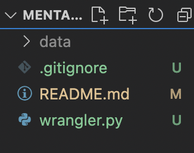

# Mental-Distress-Bot-natHACKS-2022-

Due to the grassroots nature of online network platforms on Discord and Reddit, moderators are often faced with problems on how to efficiently moderate and deliver help to members who need support. In this project, we are developing a bot to help moderators and other online volunteers deal with distressed community members and online hate and discrimination through a three-step process of identification, resource provision, and intervention.

Rationale: Discord and Reddit are heavily used; however, moderators are volunteers and can get burnt out. Implementing a bot on these platforms allows for more consistent action to be taken to foster more supportive and inclusive online communities.

# Datasets and how to access complete dataset for this project

1. First, create a directory or folder called `data` in the root for this project
   Your root directory should look like this
   
2. Next, we are going to download the following Kaggle Datasets into our `data` directory

https://www.kaggle.com/datasets/nikhileswarkomati/suicide-watch

https://www.kaggle.com/datasets/gargmanas/sentimental-analysis-for-tweets

https://www.kaggle.com/datasets/arshkandroo/behavioural-tweets

3. Now, we will unpack/unzip all of the downloaded files, and make sure to move these CSVs up to the `data` directory. You can do this by opening a seperate finder/file explorer window and just drag and drop.

Your data directory should now look like this:

4. Now, in a terminal, run `pip install -r requirements.txt`

5. Next, either run `python3 wrangler.py` or run `python wrangler.py` from the root directory. The complete dataset will be created and will be called `text_dataset.csv`, which you can load into a dataframe at any time

# To-Do list:

- Find dataset to work with.
- Using APIs to find and grab social media content and run analysis.
- Using these metrics to identify people who need help.
- Differentiate the people who need help from trolls.

Team members:

- Michael Williams
- Gavin Rozario
- Ebin Tomy
- Sarah Nguyen
- Khoa Bui

Software Architecture:
A. Moderation of Mental Distress - Suicidal Ideation

1. Identify persons who are thinking about suicide.
2. Provide resources to those thinking about suicide.
3. Reach out to persons thinking about suicide.

B. Moderation of Hate and Discrimination

1. Identify persons who are conducting hate and discrimination.
2. Provide resources to those conducting hate and discrimination.
3. Reach out to those conducting hate and discrimination.
